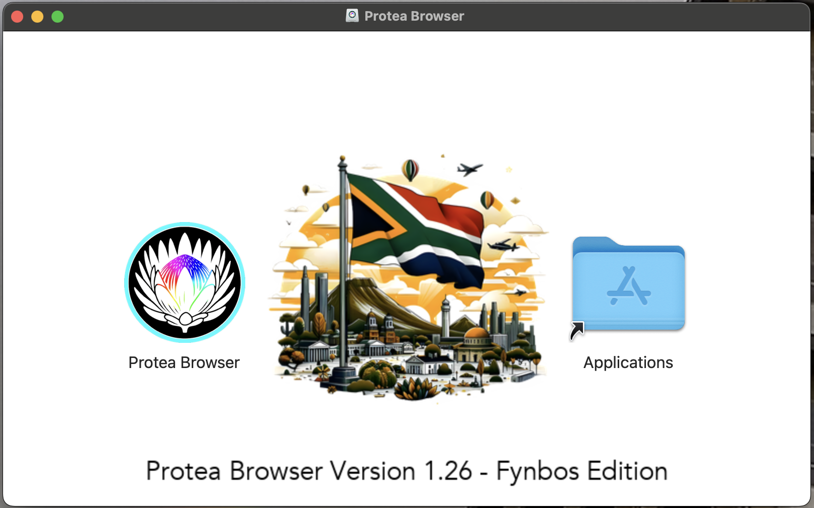

  

<h1 align="center">Protea Browser</h1>

  <strong>Fast. Elegant. Brilliantly Smart.</strong>
  <strong>Africa's Most Advanced AI Web Browser.</strong>

  
  
  

  

---

## What is Protea?

**Protea Browser** is a next-generation web browser built for speed, privacy, and intelligence. Named after South Africa's national flower, Protea represents resilience, transformation, and bold new thinking.

This is **Version 1.26 – Fynbos Edition**, featuring our groundbreaking AI integration and semantic web terraformation technology.

---

## Features

### ⚡ Blazing Performance
- Built on Chromium with custom optimizations
- Instant page loads with predictive prefetching
- Minimal memory footprint

### DNA45 AI Integration
- Native AI assistant powered by the Mankind DNA45 Thekisho-Moffat Engine
- Smart summarization, rewriting, and explanations
- Context-aware search suggestions

### SynthWeb Terraformation
- Transform cluttered websites into clean, readable views
- Semantic content extraction
- Focus mode for distraction-free reading

### Privacy First
- No telemetry, no tracking
- Built-in ad blocking
- Secure by default

### Beautiful Design
- Stunning dark mode interface
- Customizable themes
- Smooth animations throughout

---

## 📥 Download

### macOS

| Architecture | Download |
|--------------|----------|
| **Apple Silicon** (M1/M2/M3/M4) | [Download DMG](https://github.com/YourOrg/protea-releases/releases/latest) |
| **Intel** (x86_64) | Coming Soon |

> **System Requirements**: macOS 12.0 (Monterey) or later

---

## Installation

1. Download the `.dmg` file
2. Open the disk image
3. Drag **Protea Browser** to your **Applications** folder
4. Launch and enjoy!

  

---

## 📋 Release Notes

### Version 1.26 – Fynbos Edition

**New Features:**
-  DNA45 AI integration with multiple model support
-  SynthWeb semantic terraformation layer
-  40% faster cold start times
-  Redesigned home page with quick links

**Improvements:**
- Enhanced memory management
- Smoother scrolling performance
- Better tab management

**Bug Fixes:**
- Fixed occasional crash on certain websites
- Resolved bookmark sync issues
- Various UI polish

---

## About

**Protea Browser** is Africa's most advanced and well developed Web Browser developed by **Mankind Research Labs** in Sandton, South Africa.
We believe the users deserves a browser that respects users, values their time, and enhances their experience with intelligent features.

---

  <strong>© 2025-2026 Protea Browser Inc. All rights reserved.</strong>

  Made with 🩵 in Sandton by Mankind Research Labs 

